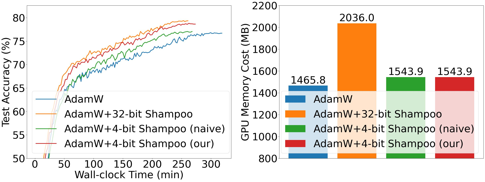
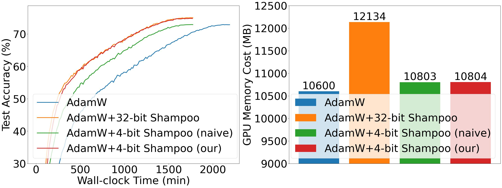

# 4-bit Shampoo

## Preparation

### Environment setup

1. Create and activate a virtual environment (optional but recommended):
   ```bash
   python -m venv .venv
   source .venv/bin/activate
   ```
2. Install Python dependencies:
   ```bash
   pip install -r requirements.txt
   ```

The core packages are `torch`, `torchvision`, `timm`, `numpy`, and `cmake` (for building the CUDA quantizer).

### CUDA quantization library

Low-bit Shampoo relies on the CUDA kernels in `cudaC_python`. When training on GPU:

```bash
cmake -B cudaC_python/build cudaC_python
cmake --build cudaC_python/build
cp cudaC_python/build/qtensor/libqtensor_cuda*.so qtensor/
```

See `cudaC_python/README.md` for more operating-system specific notes. The shared object must be rebuilt on every new machine/Colab runtime.

**CPU-only note:** If CUDA is unavailable (e.g., macOS or CPU servers), the repo now falls back to a pure PyTorch quantizer. You can skip the build step and still run 4-bit Shampoo on CPU/MPS for benchmarking.

## Usage

- `main_demo.py` shows basic model/optimizer construction.
- `train_cifar.py` trains CIFAR-100 models and supports AdamW/SGD plus the two Shampoo variants (32-bit and low-bit).

Typical CIFAR-100 run:
```bash
python train_cifar.py --download --model resnet34 --optimizer shampoo2-adamw \
                      --epochs 200 --batch-size 256 --data ./data --device cuda --amp
```
Swap `--optimizer` among `adamw`, `sgd`, `shampoo1-*`, and `shampoo2-*` to compare convergence.

When running on Google Colab, install requirements and rebuild the CUDA library as shown above, then mount Drive if you want checkpoints to persist.

## Results

(a) Swin-Tiny on CIFAR-100:

<center class="half">
    
</center>

(b) ViT-Base/32 on ImageNet-1k:

<center class="half">
    
</center>


## Citation

```latex
@article{Wang_NeurIPS_2024,
    author = {Sike Wang and Pan Zhou and Jia Li and Hua Huang},
    title = {4-bit {Shampoo} for Memory-Efficient Network Training},
    journal = {Advances in Neural Information Processing Systems},
    year = {2024},
    url = {https://arxiv.org/abs/2405.18144},
}
```
